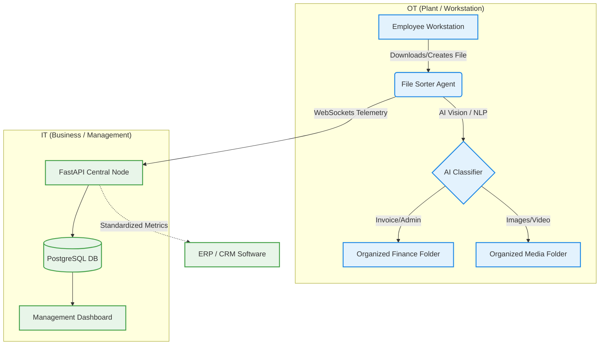

# Proyecto 1: AI Integration Design for Digital Transformation

## 1. Company Profile
**Company Name:** NexMedia Solutions S.A.
**Sector:** Media, Digital Marketing & Administration.
**Size:** Medium (50-200 employees).
**Core Business:** NexMedia provides high-volume digital ad campaigns, audiovisual asset management, and administrative services to international clients.
**Main Challenge:** The company suffers from internal "digital chaos". Administrative documents run through the same chaotic file-flow as high-bandwidth media assets. Critical delays occur because employees spend significant time cross-referencing files in disorganized `Downloads` folders and shared LAN networking.

## 2. Selected Technologies

| Technology | Area of Application | Description |
|---|---|---|
| **Artificial Intelligence (LLMs / Vision AI)**| **IT & OT (Hybrid)** | Used to parse PDF content (invoices) and visually tag media files before automatic sorting. |
| **Real-time Telemetry (WebSockets)** | **OT (Plant/Operations)** | Monitors local workstation activity instantly to ensure secure and real-time observability of file movements. |
| **Asynchronous Cloud Backends (FastAPI / PostgreSQL)** | **IT (Business)** | Centralizes all metadata to create structured reporting dashboards for management. |
| **Containerization (Docker)** | **IT (Business)** | Ensures the reliability and scaling of databases without interrupting daily operational workflows. |

## 3. Architecture & Impact Diagram (Mermaid)

## 4. Digital Transformation Proposal
By implementing an AI-driven, end-to-end framework like **File Sorter Enterprise**, NexMedia bridges the gap between manual operations (OT context: employees moving local files) and macro-business administration (IT context: global data taxonomy). 

**Optimization in Plant (Operations):** AI immediately steps in when a file is downloaded. Instead of generic extensions mapping, NLP models scan the text inside a PDF to detect if it is an urgent invoice or a generic brief. The file is auto-moved precisely where needed.
**Optimization in Business:** IT managers stop facing data loss or isolated file silos. Every file movement is asynchronously reported to a PostgreSQL backend via WebSockets, guaranteeing absolute traceability.

## 5. Final Reflection on AI Impact
The integration of Artificial Intelligence transforms passive file storage into active knowledge governance. In the present, AI removes the repetitive burden placed on employees, drastically mitigating human error. In the future, applying machine learning algorithms to this structurally clean dataset will allow the company to predict workflow bottlenecks, enabling proactive financial and creative decisions that were completely impossible in a chaotic system.
